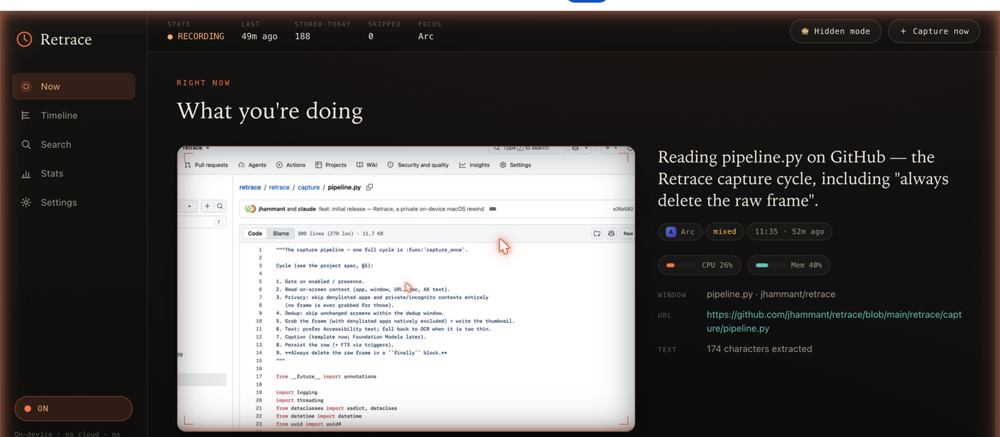
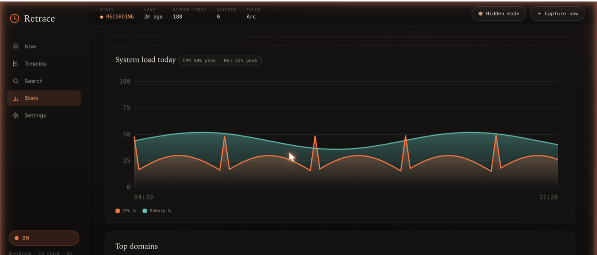
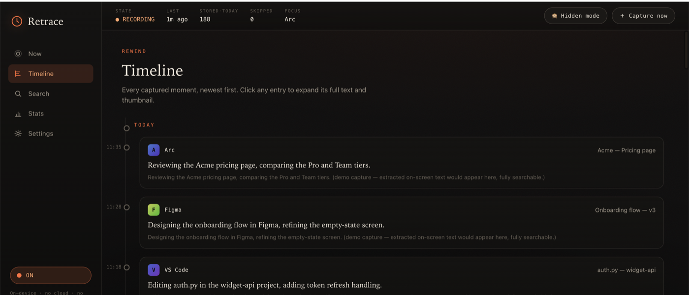

# Retrace

[](https://github.com/jhammant/retrace/actions/workflows/ci.yml)
&nbsp;
&nbsp;
&nbsp;
&nbsp;

**A private, on-device "rewind" for your Mac.** Retrace quietly captures what's on
your screen, extracts the text and context, and lets you *search and scrub back
through your day* — plus time/usage analytics. Everything runs **100% on your
machine**. No data ever leaves it. No accounts. **No telemetry.**

> **macOS only, on-device only.** Retrace is built for macOS so it can lean on
> native frameworks — ScreenCaptureKit, Accessibility, Vision, **Foundation Models**
> (the on-device LLM), NaturalLanguage embeddings, SensitiveContentAnalysis, and
> EventKit. There is no cloud component, by design.

---

## The privacy promise (the whole point)

These are hard invariants, enforced in code and covered by tests — not preferences:

- **Raw screenshots are never retained.** Each frame goes to a private temp file,
  is processed (text + a small thumbnail), then **deleted in a `finally` block** —
  removed even if anything errors. Only extracted text, a short caption, a
  downscaled JPEG thumbnail, and metadata persist. *(verified:
  `tests/test_pipeline.py` asserts the frame is gone on success, capture failure,
  and exceptions.)*
- **On-device only.** No network calls for capture, OCR, captioning, embeddings, or
  search.
- **Off by default.** Capture is disabled until you turn it on, and that choice
  persists across restarts.
- **Away = paused.** When you're idle, the screen is locked, or the display is
  asleep, Retrace stops capturing *and* stops counting time — a machine left on and
  logged in never looks "active."
- **Blocks what it shouldn't see.** A password-manager denylist, incognito/private
  windows, and adult/sensitive content (URL/keyword rules **and** an on-device image
  scan) are all skipped before anything is stored.
- **Hidden mode.** One click pauses all recording (optionally for a set time).
- **Bounded retention.** Rows + thumbnails older than your window (default 30 days)
  are purged automatically, with a manual purge too.
- **Local bind only.** API and MCP listen on `127.0.0.1`.
- **No telemetry.** Zero analytics, zero phone-home.

---

## What you get

| | |
|---|---|
| **Menu bar** | A native status-bar item (`retrace menubar`) to see live state and counters, capture now, pause, toggle Hidden mode, and open the dashboard. |
| **Now** | The latest capture, framed like a film cell, with a one-line on-device LLM caption. |
| **Timeline** | Reverse-chronological, infinite-scroll history. Click any moment to expand its full text + thumbnail. |
| **Search** | One box, three modes — **text** (FTS5), **semantic** (NaturalLanguage embeddings, fully local), and **hybrid**. |
| **Stats** | Time-by-app, top domains, daily/weekly totals, and **CPU/memory charts** — AFK-aware so idle time isn't counted. Hand-rolled offline SVG, no chart library. |
| **Settings** | Enable/disable, retention, denylist, sensitive-content + page-capture controls, permission status. |
| **MCP** | A read-only server so other agents/assistants can query your timeline, search, and stats. |
| **Plugins** | Per-app collectors / enrichers / pollers. Ships with Claude Code, Spotify, Apple Music, system stats, calendar, notifications, git commits, Apple Mail, browser downloads, recent files, clipboard, and shell history. Drop your own in `~/.retrace/plugins/`. |

---

## Screenshots

**Now** — the latest capture with an on-device caption, the now-playing track, and live CPU/memory:



**Stats** — time-by-app, weekly activity, and a CPU/memory chart (hand-rolled offline SVG):



**Timeline** — every captured moment, searchable, with expandable full text:



---

## Quickstart

Requires macOS 14+ (built/tested on macOS 26), the Xcode command-line tools
(`swiftc`), and [`uv`](https://docs.astral.sh/uv/).

```bash
make setup            # create the venv (Python 3.13) + install Retrace
make build-helpers    # compile the native Swift helpers into ~/.retrace/bin
uv run retrace init   # create ~/.retrace (config + database). Capture is OFF.
uv run retrace doctor # check permissions + capabilities

uv run retrace start    # enable capture
uv run retrace tick --force   # take one capture right now
uv run retrace serve    # open http://127.0.0.1:8765
uv run retrace menubar  # add the menu bar icon (starts the server if needed)
```

> On a notched Mac with a crowded menu bar, the icon can hide behind the notch —
> a menu bar manager (Ice / Bartender) or quitting a few menu bar apps reveals it.

The first capture triggers macOS permission prompts (Screen Recording,
Accessibility). `retrace doctor` tells you exactly what's missing and how to grant it.

---

## Architecture

```
┌──────────────────────────────────────────────────────────────────┐
│  Python core (FastAPI)                                            │
│   capture pipeline · daemon · activity · stats · search · plugins │
│   HTTP API + web UI  ·  read-only MCP server                      │
│        │  invokes (subprocess, JSON on stdout)                    │
│        ▼                                                          │
│  Swift helper binaries  (compile-on-first-use, cached in ~/.retrace/bin)
│   retrace-capture      ScreenCaptureKit frame + thumbnail (denylist excluded)
│   retrace-context      Accessibility: text / window / URL / doc / page text
│   retrace-ocr          Vision OCR fallback
│   retrace-present      idle / screen-lock / display-sleep + permission preflight
│   retrace-watch        NSWorkspace app-switch event stream (event-driven capture)
│   retrace-embed        NaturalLanguage sentence embedding
│   retrace-caption      Foundation Models text → 1-2 sentence caption
│   retrace-sensitivity  SensitiveContentAnalysis adult/NSFW image scan
└──────────────────────────────────────────────────────────────────┘
        All data under ~/.retrace  (SQLite + thumbnails). knowledgeC /
        Safari / Chrome history are read directly for time analytics.
```

The capture cycle: **gate** (enabled / present / hidden) → **context** (app, window,
URL, text) → **privacy** (denylist / incognito / sensitive) → **dedup** → **frame +
thumbnail** → **on-device sensitivity scan** → **text** (Accessibility, else OCR) →
**caption** → **embed** → **persist** → **delete the raw frame, always.**

---

## Permissions

`retrace doctor` reports each of these; Retrace degrades gracefully when one is missing.

| Permission | Needed for | Where to grant |
|---|---|---|
| **Screen Recording** (required) | capturing frames | Privacy & Security → Screen & System Audio Recording |
| **Accessibility** (required) | real on-screen text, window titles, URLs | Privacy & Security → Accessibility |
| **Automation** | browser URL + incognito detection, full page text | prompted on first use (per browser) |
| **Full Disk Access** | knowledgeC focus history + Safari history (time analytics) | Privacy & Security → Full Disk Access |
| **Calendar** | correlating captures with events | Privacy & Security → Calendars |

For full-page text capture, also enable "Allow JavaScript from Apple Events" in your
browser (Safari: Develop menu; Chrome: View → Developer).

---

## Privacy controls

- **Hidden mode** — the `🙈 Hidden mode` button (or `POST /capture/pause?minutes=N`)
  stops all recording until you resume.
- **Away handling** — "Pause when away" (on by default) plus an adjustable idle
  threshold; the header shows `◌ AWAY` / `◍ LOCKED` / `◍ DISPLAY OFF`.
- **Sensitive content** — two layers, both on by default: an editable
  domain/keyword blocklist, and an on-device **SensitiveContentAnalysis** image scan
  that drops flagged frames (activates once you enable "Sensitive Content Warning" in
  System Settings).
- **Incognito** — Chrome-family private windows are detected and never captured.
- **Denylist** — password managers and other apps you list are never captured (and
  are natively excluded from the frame via ScreenCaptureKit).

---

## App plugins

Plugins extend Retrace per-app. A plugin can **enrich** a capture (when a matching
app is frontmost), **collect** an app's own data on a schedule, and/or **poll** for
lightweight periodic sampling (every ~capture interval). Built-ins cover Claude Code
transcripts, Spotify + Apple Music now-playing, system CPU/memory, calendar (EventKit),
macOS notifications, git commits across your repos, Apple Mail subjects, browser
downloads, recently-opened files, clipboard, and shell history — all on-device.

```python
# ~/.retrace/plugins/my_app.py
from retrace.plugins import RetracePlugin

class MyApp(RetracePlugin):
    name = "my-app"
    bundle_ids = ("com.example.myapp",)

    def enrich(self, context, settings):
        return {"caption": "Doing the thing in MyApp", "text_append": "extra context"}

    def collect(self, settings):
        # read the app's data store, write captures, return a summary
        return {"name": self.name, "ingested": 0}

PLUGIN = MyApp()
```

Run collectors with `uv run retrace collect` (also runs daily in the daemon, and from
the Settings → "Collect app history" button). The built-in **Claude Code** plugin
ingests `~/.claude/projects/*.jsonl` session transcripts into your timeline, fully
searchable.

---

## MCP (read-only)

Other agents can query Retrace over MCP. It exposes **only** read/search tools — no
start/stop, no purge, no config changes:

`retrace_search` · `retrace_timeline` · `retrace_get_capture` ·
`retrace_what_was_i_doing` · `retrace_stats` · `retrace_now` · `retrace_list_apps`

Register it (e.g. in `claude_desktop_config.json` or `.mcp.json`):

```json
{
  "mcpServers": {
    "retrace": {
      "command": "uv",
      "args": ["run", "--directory", "/ABSOLUTE/PATH/TO/retrace", "retrace", "mcp"]
    }
  }
}
```

---

## HTTP API

Bound to `127.0.0.1`. Highlights:

- `GET /capture/status` · `POST /capture/start|stop|tick|pause|resume`
- `GET /capture/recent` · `GET /capture/{id}` · `GET /capture/{id}/image` · `GET /capture/{id}/html`
- `POST /capture/purge?days=`
- `GET /search?q=&mode=text|semantic|hybrid`
- `POST /activity/scan` · `GET /activity/apps|domains|status`
- `GET /stats/daily|weekly|top`
- `GET /permissions` · `GET|POST /config` · `GET /plugins` · `POST /plugins/collect`

---

## Configuration

`~/.retrace/config.toml` (env vars `RETRACE_*` override it; both override defaults).
Edit the common ones in the Settings panel. Keys include: `capture_interval_s`,
`dedup_window_s`, `idle_threshold_s`, `pause_when_away`, `retention_days`,
`thumb_max_edge`, `enable_semantic_search`, `enable_caption`, `denylist_bundle_ids`,
`capture_private_browsing`, `block_sensitive_content`, `block_sensitive_images`,
`sensitive_domains`, `sensitive_keywords`, `capture_page_text`, `capture_page_html`,
`enable_plugins`, `disabled_plugins`.

---

## Run it in the background

A launchd user-agent template lives at `scripts/com.retrace.daemon.plist` (edit the
two absolute paths, then `launchctl load -w ~/Library/LaunchAgents/...`). See the
comments in that file for install/uninstall.

---

## Development

```bash
make test            # run the test suite (isolated temp DB; never touches ~/.retrace)
make build-helpers   # (re)compile the Swift helpers
make run             # retrace serve
```

Tests use a throwaway `RETRACE_HOME` and refuse to run against your real database.
Native helpers are stubbed by default so the suite is fast and needs no Swift toolchain.

| Path | Purpose |
|---|---|
| `~/.retrace/retrace.db` | SQLite: captures, activity, FTS5, embeddings |
| `~/.retrace/thumbs/YYYY-MM-DD/*.jpg` | downscaled thumbnails |
| `~/.retrace/tmp/` | transient raw frames (deleted every cycle) |
| `~/.retrace/status.json` | capture ledger |
| `~/.retrace/config.toml` | user config |
| `~/.retrace/bin/` | compiled Swift helpers (cache) |
| `~/.retrace/plugins/` | your custom app plugins |

Screenshots of the UI live in [`docs/screenshots/`](docs/screenshots).

---

## License

[Apache-2.0](LICENSE). Built only on third-party + Apple frameworks. No telemetry,
ever.
